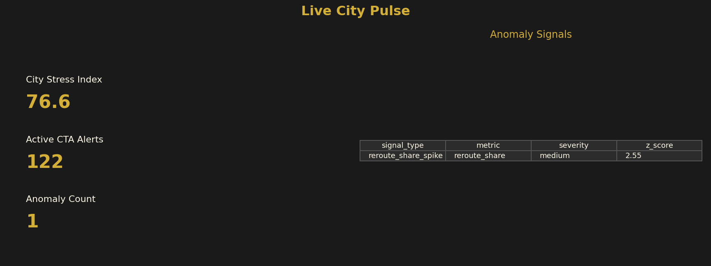

# AQ PulseGrid

Real-time Spark-powered urban intelligence platform combining streaming public datasets, machine learning, geospatial analytics, and automated Power BI PBIP generation.

AQ PulseGrid is a Spark-powered urban intelligence platform that combines streaming public datasets, machine learning, geospatial analytics, and automated Power BI PBIP generation into a modern AI-ready analytics system.

[](https://www.python.org/)
[](https://spark.apache.org/)
[](https://www.databricks.com/)
[](https://powerbi.microsoft.com/)
[](https://delta.io/)
[](LICENSE)

**Repository:** [github.com/prendle-aureaquantra/aq-pulsegrid](https://github.com/prendle-aureaquantra/aq-pulsegrid)

> Public demo by [Aurea Quantra](https://aureaquantra.com). Chicago Phase 1 MVP.

## Core features

- Spark Structured Streaming (micro-batch + PySpark `readStream`)
- Delta Lake medallion architecture (bronze / silver / gold)
- ML anomaly detection + **City Pulse Score** (0–100 stress index)
- Geospatial hex grid intelligence
- Semantic BI modeling + DAX measures
- **Automated Power BI PBIP generation** (metadata-driven visuals + themes)
- Real-time operational analytics from public APIs

## System capabilities

- Real-time streaming ingestion
- Spark medallion architecture
- Delta Lake pipelines
- Geospatial enrichment
- ML anomaly detection
- AI signal scoring
- Metadata-driven semantic modeling
- Automated Power BI PBIP generation
- GitHub Actions CI/CD
- Containerized local deployment

## Demo in 60 seconds

```bash
git clone https://github.com/prendle-aureaquantra/aq-pulsegrid.git
cd aq-pulsegrid
cp .env.example .env
python -m venv .venv && .venv\Scripts\activate   # Windows
pip install -e ".[dev]"
python generate_city.py --city chicago --with-visuals
```

Open **`~/.local/aq-pulsegrid/reports/chicago/ChicagoPulse.pbip`** in Power BI Desktop → Load → Publish.

Sample in repo: [`generated_reports/chicago/ChicagoPulse.pbip`](generated_reports/chicago/ChicagoPulse.pbip)



## Architecture

```text
┌──────────────────────────────┐
│ Public APIs / Live Feeds     │
└──────────────┬───────────────┘
               ↓
┌──────────────────────────────┐
│ Spark Structured Streaming   │
└──────────────┬───────────────┘
               ↓
┌──────────────────────────────┐
│ Bronze / Silver / Gold       │
│ Delta Lakehouse              │
└──────────────┬───────────────┘
               ↓
┌──────────────────────────────┐
│ ML + Signal Scoring Engine   │
└──────────────┬───────────────┘
               ↓
┌──────────────────────────────┐
│ PBIP Generator               │
└──────────────┬───────────────┘
               ↓
┌──────────────────────────────┐
│ Power BI Dashboards          │
└──────────────────────────────┘
```

Detailed diagram: [docs/ARCHITECTURE.md](docs/ARCHITECTURE.md) · Positioning: [docs/POSITIONING.md](docs/POSITIONING.md)

## What you get (Chicago MVP)

| Layer | Output |
|-------|--------|
| Bronze | NOAA, CTA, airport METAR, optional Trends/FRED JSON |
| Silver / Gold | Delta tables under `~/.local/aq-pulsegrid/delta/` |
| ML | City Pulse Score, anomaly signals |
| BI | **ChicagoPulse.pbip** — 4 pages, Aurea Quantra gold theme |

## Commands

```bash
python generate_city.py --city chicago --ingest-only
python generate_city.py --city chicago --extended-ingest   # + airport, trends, FRED
python generate_city.py --city chicago --stream            # micro-batch bronze log
python generate_city.py --city chicago --stream-spark      # PySpark Structured Streaming
python generate_city.py --city chicago --pbip-only --with-visuals
python generate_city.py --city chicago --with-visuals      # full pipeline
python tools/deploy_databricks_job.py
python -m pulsegrid.alerts.notify chicago
```

## Technical stack

| Layer | Technology |
|-------|------------|
| Compute | PySpark |
| Streaming | Spark Structured Streaming |
| Storage | Delta Lake |
| ML | pandas + custom scoring |
| Geospatial | Hex grid (Sedona-ready) |
| BI | Power BI PBIP |
| Automation | Python metadata → TMDL + PBIR |
| Containers | Docker / Dev Containers |
| CI/CD | GitHub Actions |

## Configuration

Copy [`.env.example`](.env.example) → `.env`. **Never commit `.env`.**

| Variable | Purpose |
|----------|---------|
| `PULSEGRID_DATA_ROOT` | Delta + PBIP mirror (default `~/.local/aq-pulsegrid`) |
| `FRED_API_KEY` | Optional FRED macro ingest |
| `AUREAQUANTRA_GITHUB_TOKEN` | PAT for [prendle-aureaquantra](https://github.com/prendle-aureaquantra) org push/CI |
| `DATABRICKS_HOST` / `DATABRICKS_TOKEN` | Optional Databricks job deploy |

## Why this project exists

Modern analytics systems increasingly require real-time signal fusion across operational, environmental, geospatial, and behavioral datasets. AQ PulseGrid demonstrates how Spark, machine learning, semantic BI modeling, and automated Power BI generation combine into a modern AI-ready analytics platform.

## Roadmap

[docs/ROADMAP.md](docs/ROADMAP.md) — Sedona maps, Fabric embed, multi-city, replay engine, AI copilot layer.

## License

MIT — see [LICENSE](LICENSE).
