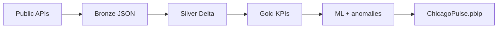

# AQ PulseGrid

**Spark-powered urban intelligence** — streaming public data, Delta medallion, ML stress scoring, and automated Power BI PBIP generation.

[](https://github.com/aureaquantra/aq-pulsegrid/actions/workflows/ci.yml)

> Public demo platform by [Aurea Quantra](https://aureaquantra.com). Chicago Phase 1 MVP.

## Demo in 60 seconds

```bash
git clone https://github.com/YOUR_ORG/aq-pulsegrid.git
cd aq-pulsegrid
cp .env.example .env
python -m venv .venv && .venv\Scripts\activate   # Windows
pip install -e ".[dev]"
python generate_city.py --city chicago --with-visuals
```

Open **`~/.local/aq-pulsegrid/reports/chicago/ChicagoPulse.pbip`** in Power BI Desktop → Load → Publish.

Or use the committed sample: [`generated_reports/chicago/ChicagoPulse.pbip`](generated_reports/chicago/ChicagoPulse.pbip) (run `--pbip-only` to refresh CSV paths).

## What you get

| Layer | Output |
|-------|--------|
| Bronze | NOAA, CTA, airport METAR, optional Trends/FRED JSON |
| Silver / Gold | Delta tables under `~/.local/aq-pulsegrid/delta/` |
| ML | City Stress Index (0–100), anomaly signals |
| BI | **ChicagoPulse.pbip** — 3 pages, Aurea Quantra gold theme, KPI cards + charts |


## Commands

```bash
python generate_city.py --city chicago --ingest-only
python generate_city.py --city chicago --extended-ingest   # + airport, trends, FRED
python generate_city.py --city chicago --stream            # micro-batch bronze log
python generate_city.py --city chicago --transform-only
python generate_city.py --city chicago --ml-only
python generate_city.py --city chicago --pbip-only --with-visuals
python generate_city.py --city chicago --with-visuals      # full pipeline + styled PBIP
python tools/capture_readme_screenshots.py --city chicago
python tools/run_databricks_pipeline.py --local-only
python -m pulsegrid.alerts.notify chicago                  # after ML + env webhooks
```

## Architecture



Full diagram: [docs/ARCHITECTURE.md](docs/ARCHITECTURE.md)

## Configuration

| Variable | Purpose |
|----------|---------|
| `PULSEGRID_DATA_ROOT` | Delta + PBIP mirror (default `~/.local/aq-pulsegrid`) |
| `FRED_API_KEY` | Optional FRED ingest |
| `PULSEGRID_SLACK_WEBHOOK_URL` | High-severity anomaly alerts |

Copy [`.env.example`](.env.example) → `.env`. **Never commit `.env`.**

## Sample PBIP

```
generated_reports/chicago/
  ChicagoPulse.pbip
  ChicagoPulse.Report/      # PBIR report + visuals
  ChicagoPulse.SemanticModel/
  data/*.csv                # small static extracts for Desktop
```

## Roadmap

Phase 1 gaps (Trends, FRED, airport silver/gold), Databricks jobs, site embed, Sedona maps — [docs/ROADMAP.md](docs/ROADMAP.md).

## Publish this repo

[docs/GITHUB_PUBLISH.md](docs/GITHUB_PUBLISH.md)

## License

MIT — see [LICENSE](LICENSE).
