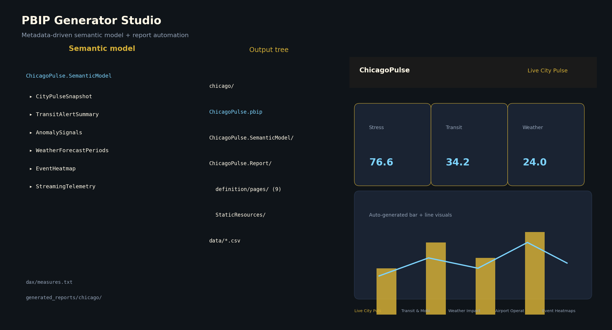
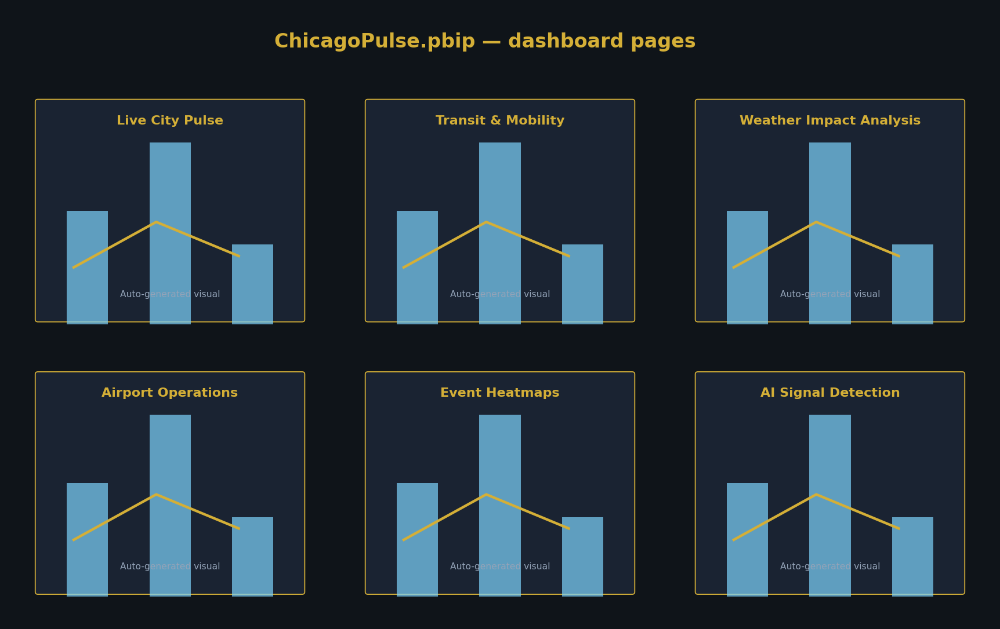
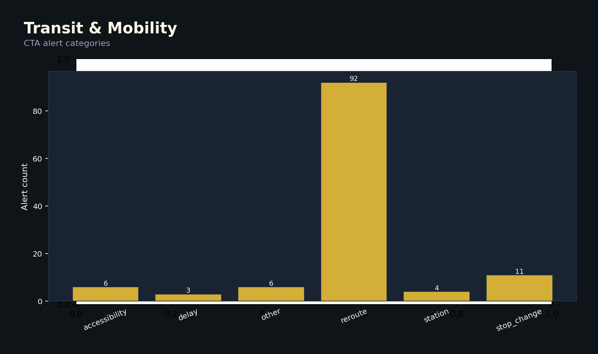
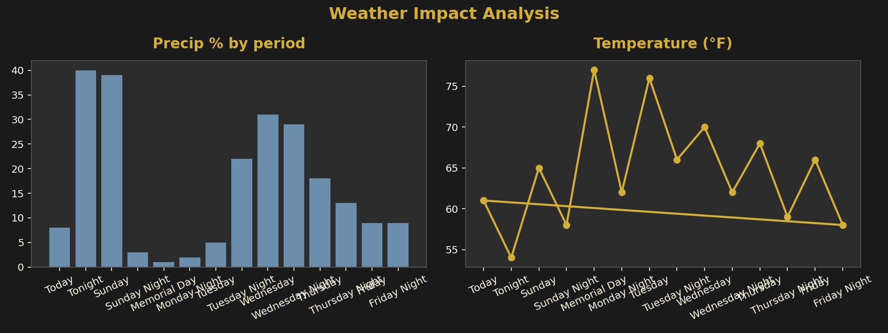
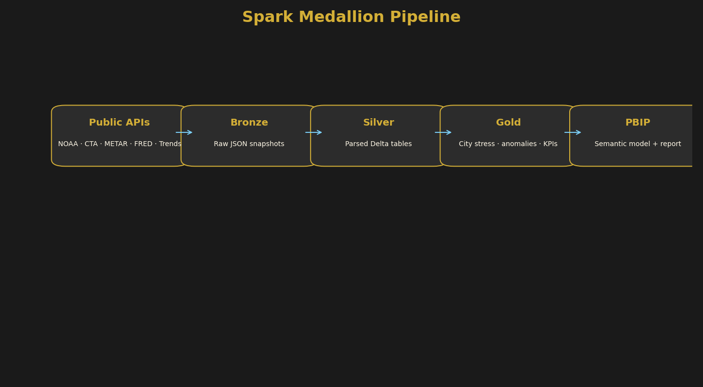
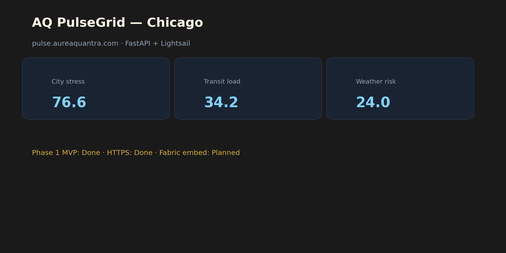

# AQ PulseGrid

Real-time Spark-powered urban intelligence platform combining streaming public datasets, machine learning, geospatial analytics, and automated Power BI PBIP generation.

AQ PulseGrid is a Spark-powered urban intelligence platform that combines streaming public datasets, machine learning, geospatial analytics, and automated Power BI PBIP generation into a modern AI-ready analytics system.

[](https://www.python.org/)
[](https://spark.apache.org/)
[](https://www.databricks.com/)
[](https://powerbi.microsoft.com/)
[](https://delta.io/)
[](LICENSE)

**Repository:** [github.com/prendle-aureaquantra/aq-pulsegrid](https://github.com/prendle-aureaquantra/aq-pulsegrid)

> Public demo by [Aurea Quantra](https://aureaquantra.com). **Phase 2:** worldwide metros + metro slicer.

See [docs/PHASE2.md](docs/PHASE2.md) for multi-metro CLI, Databricks global job, and public feeds.

**After git pull:** if Power BI shows *“file path must be a valid absolute path”*, run `python tools/fix_pbip_csv_paths.py generated_reports/chicago` or regenerate the PBIP ([docs/FABRIC_EMBED.md](docs/FABRIC_EMBED.md)).

**Feed coverage:** `python tools/ingest_feed_coverage.py` · **Copilot prompts:** `python -m pulsegrid.copilot.insights chicago --list-prompts`

> **Live ops status:** [pulse.aureaquantra.com](https://pulse.aureaquantra.com)

---

## Reviewer Quick Path

If you are reviewing this project quickly:

1. Start with `README.md` · live ops: [pulse.aureaquantra.com](https://pulse.aureaquantra.com)
2. Review [`docs/ARCHITECTURE.md`](docs/ARCHITECTURE.md)
3. Inspect [`generate_city.py`](generate_city.py)
4. Open [`pbip_generator/`](pbip_generator/) · platform PBIP: `generated_reports/platform/PulseGrid.pbip`
5. **Chicago full demo (PBIP + visuals):** `python generate_city.py --city chicago --extended-ingest --with-visuals`
6. **Platform refresh (no PBIP wipe):** `python generate_city.py --all-metros --platform-csv-only`
7. Check [`pulsegrid/web/status_app.py`](pulsegrid/web/status_app.py) · [`deploy/lightsail/`](deploy/lightsail/)

---

## Why the PBIP Generator Matters

AQ PulseGrid does not only create analytics outputs.

It generates Power BI project artifacts from metadata, including semantic model structure, DAX measures, themed report pages, and generated PBIP report folders.

This demonstrates a more advanced BI engineering pattern: **automated semantic BI generation** rather than manual dashboard construction.



Nine themed report pages (~28 visuals) are generated from semantic metadata — no manual Power BI layout work.

---

## Project Health

| Area | Status |
|------|--------|
| Spark pipeline scaffold | Active |
| Public data ingestion (71 metros) | Active |
| Platform PBIP + metro slicer | Active |
| ML scoring (Option A schedule) | Active |
| Web status app (Lightsail) | Active |
| Databricks daily job | Active — redeploy bundle after `databricks.yml` changes |
| Fabric embed on site | Pending Desktop publish |
| Feed coverage boost | `python generate_city.py --boost-feeds` |

---

## Core features

- Spark Structured Streaming (micro-batch + PySpark `readStream`)
- Delta Lake medallion architecture (bronze / silver / gold)
- ML anomaly detection + **City Pulse Score** (0–100 stress index)
- Geospatial hex grid intelligence
- Semantic BI modeling + DAX measures
- **Automated Power BI PBIP generation** (metadata-driven visuals + themes)
- Real-time operational analytics from public APIs

---

## Demo in 60 seconds

```bash
git clone https://github.com/prendle-aureaquantra/aq-pulsegrid.git
cd aq-pulsegrid
cp .env.example .env
python -m venv .venv
source .venv/bin/activate
pip install -e ".[dev]"
python generate_city.py --city chicago --with-visuals
```

Windows (PowerShell):

```powershell
python -m venv .venv
.venv\Scripts\activate
pip install -e ".[dev]"
python generate_city.py --city chicago --with-visuals
```

Open **`~/.local/aq-pulsegrid/reports/chicago/ChicagoPulse.pbip`** in Power BI Desktop, then Load and Publish.

Sample in repo: [`generated_reports/chicago/ChicagoPulse.pbip`](generated_reports/chicago/ChicagoPulse.pbip)

---

## Screenshots

| Screenshot | Description |
|------------|-------------|
|  | Operations-center KPIs, stress gauge, anomaly table |
|  | All nine ChicagoPulse.pbip report pages |
|  | Semantic model, output tree, and report canvas |
|  | CTA alert categories from gold layer |
|  | NOAA precip and temperature forecast |
|  | Bronze → silver → gold → PBIP flow |
|  | Live ops console at pulse.aureaquantra.com |

Regenerate PNGs:

```bash
python tools/capture_readme_screenshots.py --city chicago --screenshots-only
python tools/capture_readme_screenshots.py --city chicago --preview-only
python tools/capture_readme_screenshots.py --city chicago --platform-only
```

---

## Operational Web Console

AQ PulseGrid includes a lightweight operational web console for enterprise-style delivery surfaces.

| Surface | Location |
|---------|----------|
| **FastAPI status app** | [`pulsegrid/web/status_app.py`](pulsegrid/web/status_app.py) |
| **Lightsail deploy** | [`deploy/lightsail/`](deploy/lightsail/) |
| **Live HTTPS endpoint** | [https://pulse.aureaquantra.com](https://pulse.aureaquantra.com) |
| **ASP.NET sibling demo** | Aurea Quantra monorepo `asp-demo-dashboard` (separate operational BI demo) |

See [`docs/OPERATIONAL_WEB_CONSOLE.md`](docs/OPERATIONAL_WEB_CONSOLE.md) and [`web/README.md`](web/README.md).

---

## Architecture

```text
┌──────────────────────────────┐
│ Public APIs / Live Feeds     │
└──────────────┬───────────────┘
               ↓
┌──────────────────────────────┐
│ Spark Structured Streaming   │
└──────────────┬───────────────┘
               ↓
┌──────────────────────────────┐
│ Bronze / Silver / Gold       │
│ Delta Lakehouse              │
└──────────────┬───────────────┘
               ↓
┌──────────────────────────────┐
│ ML + Signal Scoring Engine   │
└──────────────┬───────────────┘
               ↓
┌──────────────────────────────┐
│ PBIP Generator               │
└──────────────┬───────────────┘
               ↓
┌──────────────────────────────┐
│ Power BI Dashboards          │
└──────────────────────────────┘
```


Detailed diagram: [docs/ARCHITECTURE.md](docs/ARCHITECTURE.md)

Positioning: [docs/POSITIONING.md](docs/POSITIONING.md)

---

## What you get (Chicago MVP)

| Layer | Output |
|-------|--------|
| Bronze | NOAA, public transit alerts, airport METAR, optional Trends/FRED JSON |
| Silver / Gold | Delta tables under `~/.local/aq-pulsegrid/delta/` |
| ML | City Pulse Score, anomaly signals |
| BI | **ChicagoPulse.pbip** — 9 pages, ~28 visuals, Aurea Quantra gold theme |

---

## Commands

```bash
python generate_city.py --city chicago --extended-ingest --with-visuals
python replay_city.py --city chicago --date 2026-05-23
python -m pulsegrid.copilot.insights chicago
python -m pulsegrid.copilot.insights chicago --prompt "Why is the City Stress Index elevated?"
python tools/run_synthetic_eval.py --category executive --city chicago --limit 3
python tools/sync_pulsegrid_site_page.py --out docs/pulsegrid-page.html
```

See [docs/SYNTHETIC_QUESTIONS.md](docs/SYNTHETIC_QUESTIONS.md) for evaluation prompts, semantic mappings, and demo narratives.

---

## Technical stack

| Layer | Technology |
|-------|------------|
| Compute | PySpark |
| Streaming | Spark Structured Streaming |
| Storage | Delta Lake |
| ML | pandas + custom scoring |
| Geospatial | Hex grid (Sedona-ready) |
| BI | Power BI PBIP |
| Automation | Python metadata to TMDL + PBIR |
| Containers | Docker / Dev Containers |
| CI/CD | GitHub Actions |

---

## Configuration

Copy [`.env.example`](.env.example) to `.env`. **Never commit `.env`.**

| Variable | Purpose |
|----------|---------|
| `PULSEGRID_DATA_ROOT` | Delta + PBIP mirror (default `~/.local/aq-pulsegrid`) |
| `FRED_API_KEY` | Optional FRED macro ingest |
| `AUREAQUANTRA_GITHUB_TOKEN` | PAT for [prendle-aureaquantra](https://github.com/prendle-aureaquantra) org push/CI |
| `DATABRICKS_HOST` / `DATABRICKS_TOKEN` | Optional Databricks job deploy |
| `POWERBI_PULSEGRID_EMBED_URL` | Fabric embed for status page + WordPress |

---

## Why this project exists

Modern analytics systems increasingly require real-time signal fusion across operational, environmental, geospatial, and behavioral datasets.

AQ PulseGrid demonstrates how Spark, machine learning, semantic BI modeling, and automated Power BI generation combine into a modern AI-ready analytics platform.

---

## Roadmap

[docs/ROADMAP.md](docs/ROADMAP.md) · [docs/PHASE2.md](docs/PHASE2.md) — Fabric embed, Sedona, worldwide metros.

---

## License

MIT — see [LICENSE](LICENSE).
