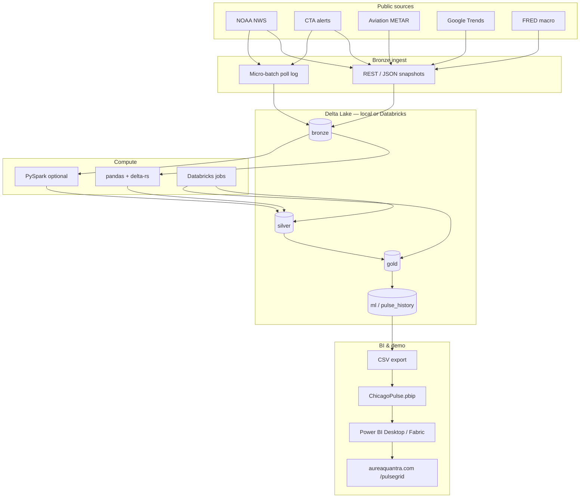

# Architecture

AQ PulseGrid implements a medallion lakehouse for urban intelligence: public APIs and streaming polls land in bronze, curated silver tables feed gold KPIs and ML scores, and a programmatic PBIP generator ships Power BI assets.

## Medallion tables (Chicago)

| Layer | Tables |
|-------|--------|
| Silver | `transit_alerts`, `weather_alerts`, `weather_forecast_periods` |
| Gold | `transit_alert_summary`, `city_pulse_snapshot`, `city_stress_index`, `anomaly_signals` |
| ML | `pulse_history` (append) |

## Tech stack

| Layer | Technology |
|-------|------------|
| Ingest | Python, `requests`, optional `pytrends` |
| Storage | Delta Lake (`deltalake` / PySpark) |
| ML | pandas scoring + z-score anomalies |
| BI | Power BI PBIP (TMDL + PBIR visuals) |
| CI | GitHub Actions |
| Cloud (optional) | Databricks notebooks + jobs |

## Visual style

Dark cinematic UI — charcoal `#1A1A1A`, gold `#D4AF37`, cream `#FFF8E7` (`AureaQuantraPulse.json`).

See also [PHASE1.md](PHASE1.md), [ROADMAP.md](ROADMAP.md).
